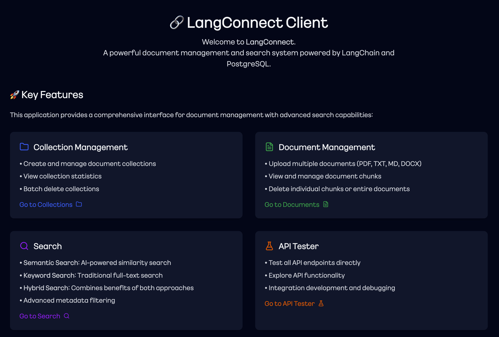
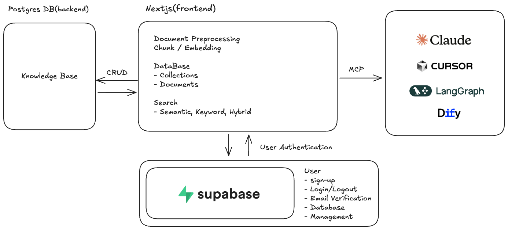

# LangConnect Client

<div align="center">

[English README](./README.md) | [한국어 README](./README_ko.md)

</div>

<div align="center">


**A GUI Interface for Vector Database Management**



</div>

## 📋 Table of Contents

- [Overview](#overview)
- [Main Features](#main-features)
- [Architecture](#architecture)
- [Getting Started](#getting-started)
  - [Prerequisites](#prerequisites)
  - [Installation](#installation)
  - [Running the Application](#running-the-application)
- [MCP Integration](#mcp-integration)
- [Environment Variables](#environment-variables)
- [API Documentation](#api-documentation)
- [Contributors](#contributors)
- [License](#license)

## 🎯 Overview

LangConnect Client is a modern, Next.js-based GUI interface for managing vector databases powered by PostgreSQL with pgvector extension. It provides an intuitive web interface for document management, vector search capabilities, and seamless integration with AI assistants through the Model Context Protocol (MCP).

This project was inspired by [langchain-ai/langconnect](https://github.com/langchain-ai/langconnect).

## ✨ Main Features

### 📚 **Collection Management**
- CRUD operations with custom metadata support
- Real-time statistics and bulk operations

### 📄 **Document Management**
- Multi-format support (PDF, TXT, MD, DOCX, HTML)
- Automatic text extraction and chunking
- Drag-and-drop batch upload

### 🔍 **Advanced Search**
- **Semantic**: Vector similarity search with OpenAI embeddings
- **Keyword**: PostgreSQL full-text search
- **Hybrid**: Combined search with configurable weights

### 🔐 **Authentication**
- Supabase JWT authentication with automatic token refresh
- Role-based access control
- Secure refresh token management with NextAuth.js

### 🤖 **MCP Integration**
- 9+ tools for AI assistants (Claude, Cursor)
- stdio and SSE transport support

### 🎨 **Modern UI**
- Next.js with Tailwind CSS
- Dark/Light themes, Multi-language (EN/KO)

## 🏗️ Architecture



### Authentication Flow

The authentication system implements a secure token refresh mechanism:

```
┌─────────────┐     ┌──────────────┐     ┌───────────┐
│   Browser   │────▶│   NextAuth   │────▶│ Supabase  │
│             │◀────│   (JWT)      │◀────│   Auth    │
└─────────────┘     └──────────────┘     └───────────┘
     │                      │
     │ httpOnly cookie     │ refresh token
     │ (encrypted JWT)     │ stored in JWT
     │                      │
     ▼                      ▼
 Only accessToken      Auto refresh when
 exposed to client     accessToken expires
```

**Key Security Features:**
- Refresh tokens are never exposed to the client
- Automatic token refresh when access token expires
- Token rotation on each refresh for enhanced security
- Encrypted JWT storage in httpOnly cookies

## 🚀 Getting Started

### Quick Start

```bash
# Clone and setup
git clone https://github.com/teddynote-lab/langconnect-client.git
cd langconnect-client
cp .env.example .env

# Edit .env with your credentials, then:
make build   # Build Docker images
make up      # Start all services
```

Create MCP configuration

```bash
make mcp
```

Stop services

```bash
make down
```

### Prerequisites

- Docker and Docker Compose
- Node.js 20+ (for MCP inspector)
- Python 3.11+ with UV package manager
- Supabase account

### Installation

1. **Clone the repository**
   ```bash
   git clone https://github.com/teddynote-lab/langconnect-client.git
   cd langconnect-client
   ```

2. **Set up environment variables**
   ```bash
   cp .env.example .env
   ```

3. **Configure Supabase**
   
   a. Create a new project at [supabase.com](https://supabase.com)
   
   b. Get your API credentials:
      - Go to Project Settings → API
      - Copy the `URL` and `anon public` key
   
   c. Update `.env` file:
   ```env
   SUPABASE_URL=https://your-project.supabase.co
   SUPABASE_KEY=your-anon-public-key
   ```

4. **Build the application**
   ```bash
   make build
   ```

### Running the Application

1. **Start all services**
   ```bash
   make up
   ```

2. **Access the services**
   - 🎨 **Frontend**: http://localhost:3000
   - 📚 **API Documentation**: http://localhost:8080/docs
   - 🔍 **Health Check**: http://localhost:8080/health

3. **Stop services**
   ```bash
   make down
   ```

4. **View logs**
   ```bash
   make logs
   ```

## 🤖 MCP Integration

### Automated Setup

1. **Generate MCP configuration**
   ```bash
   make mcp
   ```
   
   This command will:
   - Prompt for your Supabase credentials
   - Automatically obtain an access token
   - Update `.env` with the token
   - Generate `mcp/mcp_config.json`

2. **Integration with AI Assistants**

   **For Claude Desktop:**
   - Copy the contents of `mcp/mcp_config.json`
   - Paste into Claude Desktop's MCP settings

   **For Cursor:**
   - Copy the MCP configuration
   - Add to Cursor's settings under MCP integrations

### Available MCP Tools

- `search_documents` - Perform semantic/keyword/hybrid search
- `list_collections` - List all collections
- `get_collection` - Get collection details
- `create_collection` - Create new collection
- `delete_collection` - Delete collection
- `list_documents` - List documents in collection
- `add_documents` - Add text documents
- `delete_document` - Delete documents
- `get_health_status` - Check API health
- `multi_query` - Generate multiple search queries from a single question

### Sample RAG Prompt

Here is a sample RAG prompt that can be used in Claude Desktop.

```markdown
You are a question-answer assistant based on given document.
You must use MCP tool(`langconnect-rag-mcp`) to answer the question.

#Search Configuration:
- Target Collection: (user's request, default value: RAG)
- Search Type: hybrid(preferred)
- Search Limit: 5(default)

#Search Guidelines:
Follow the guidelines step-by-step to find the answer.
1. Use `list_collections` to list up collections and find right **Collection ID** for user's request.
2. Use `multi_query` to generate at least 3 sub-questions which are related to original user's request.
3. Search all queries generated from previous step(`multi_query`) and find useful documents from collection.
4. Use searched documents to answer the question.

---

## Format:
(answer to the question)

**Source**
- [1] (Source and page numbers)
- [2] (Source and page numbers)
- ...

---

[Note]
- Answer in same language as user's request
- Append sources that you've referenced at the very end of your answer.
- If you can't find your answer from <search_results>, just say you can't find any relevant source to answer the question without any narrative sentences.
```

### Running MCP SSE Server

#### Quick Start with Script

```bash
# Use the convenient launcher script
./run_mcp_sse.sh
```

This script will:
- Check if all requirements are met (uv, .env file)
- Verify API server is running
- Start the MCP SSE server with automatic authentication

#### Manual Start

```bash
# Or run directly
uv run python mcp/mcp_sse_server.py
```

The server now includes automatic authentication:
- Tests existing token validity on startup
- Prompts for login if token is expired or missing
- Automatically updates `.env` with new token
- Starts the SSE server on port 8765

### Testing MCP Integration

```bash
# Test with MCP Inspector
npx @modelcontextprotocol/inspector
```

In the Inspector:
1. Select "SSE" as transport type
2. Enter `http://localhost:8765/sse` as URL
3. Connect and test the available tools

## 🔧 Environment Variables

| Variable | Description | Required |
|----------|-------------|----------|
| `OPENAI_API_KEY` | OpenAI API key for embeddings | Yes |
| `SUPABASE_URL` | Supabase project URL | Yes |
| `SUPABASE_KEY` | Supabase anon public key | Yes |
| `NEXTAUTH_SECRET` | NextAuth.js secret key | Yes |
| `NEXTAUTH_URL` | NextAuth URL (default: http://localhost:3000) | Yes |
| `NEXT_PUBLIC_API_URL` | Public API URL for frontend | Yes |
| `POSTGRES_HOST` | PostgreSQL host (default: postgres) | No |
| `POSTGRES_PORT` | PostgreSQL port (default: 5432) | No |
| `POSTGRES_USER` | PostgreSQL user (default: teddynote) | No |
| `POSTGRES_PASSWORD` | PostgreSQL password | No |
| `POSTGRES_DB` | PostgreSQL database name | No |
| `SSE_PORT` | MCP SSE server port (default: 8765) | No |


## 👥 Contributors

<table>
  <tbody>
    <tr>
      <td align="center">
        <a href="https://github.com/teddylee777">
          
          <br />
          <sub><b>Teddy Lee</b></sub>
        </a>
        <br />
        <a href="https://teddylee777.github.io/" title="Portfolio">🏠</a>
      </td>
      <td align="center">
        <a href="https://github.com/fbwndrud">
          
          <br />
          <sub><b>fbwndrud</b></sub>
        </a>
        <br />
        <a href="https://github.com/fbwndrud" title="GitHub">🏠</a>
      </td>
      <td align="center" valign="top" width="14.28%">
        <a href="https://github.com/jikime">
          
          <br />
          <sub><b>jikime</b></sub>
        </a>
        <br />
        <a href="https://github.com/jikime/next-connect-ui/commits?author=jikime" title="Code">💻</a>
        <a href="https://github.com/jikime/next-connect-ui/pulls?q=is%3Apr+author%3Ajikime" title="Pull Requests">💪</a>
      </td>
      <td valign="top">
        <strong>Key Contributions</strong>
        <ul>
          <li>Next-Connect-UI Development</li>
        </ul>
        <strong>Community</strong>
        <ul>
          <li><a href="https://www.facebook.com/groups/1183007433518603">Vibe Coding KR Facebook Group</a></li>
        </ul>
      </td>
    </tr>
  </tbody>
</table>

## 📄 License

This project is licensed under the MIT License - see the [LICENSE](LICENSE) file for details.

<div align="center">
Made with ❤️ by <a href="https://github.com/teddynote-lab">TeddyNote LAB</a>
</div>