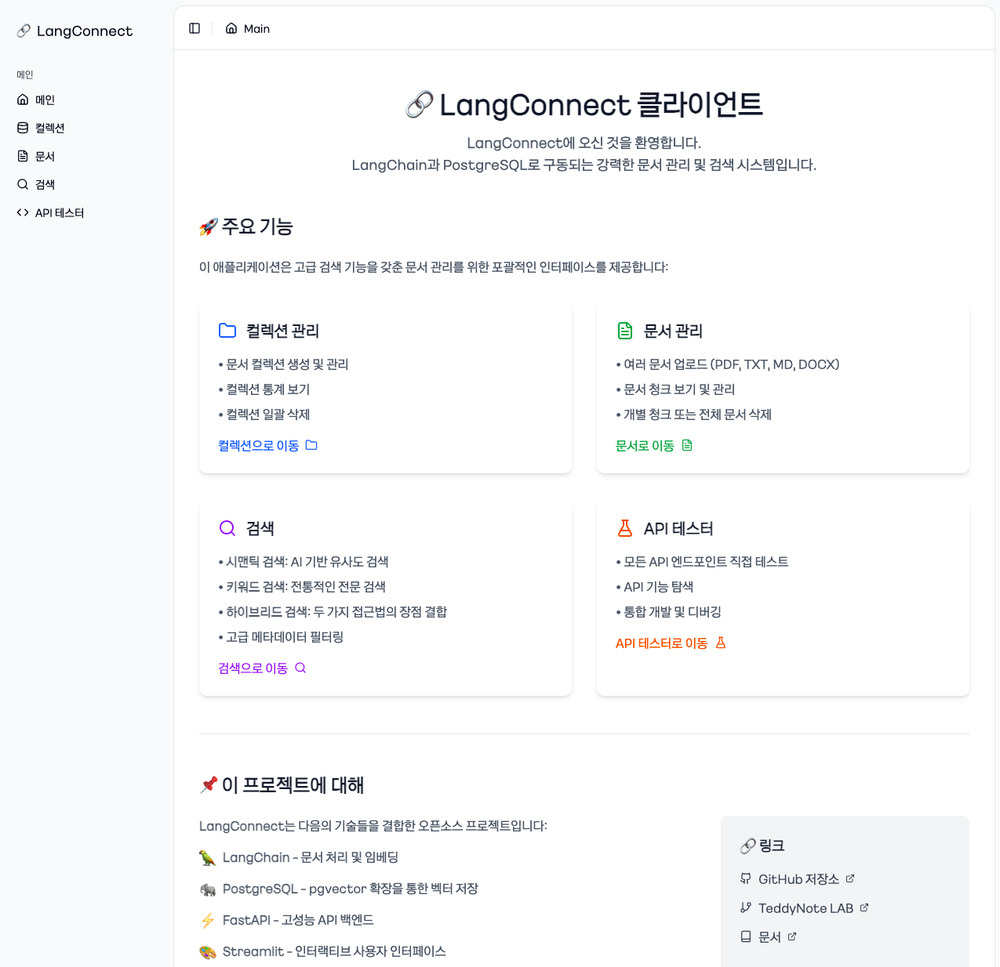
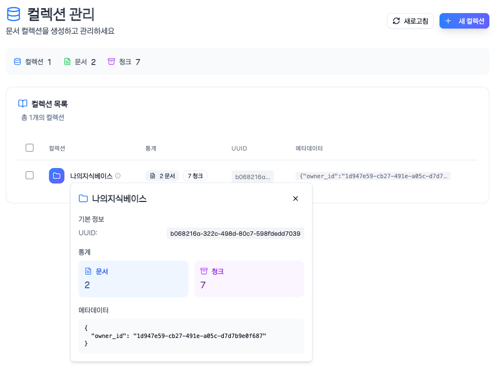
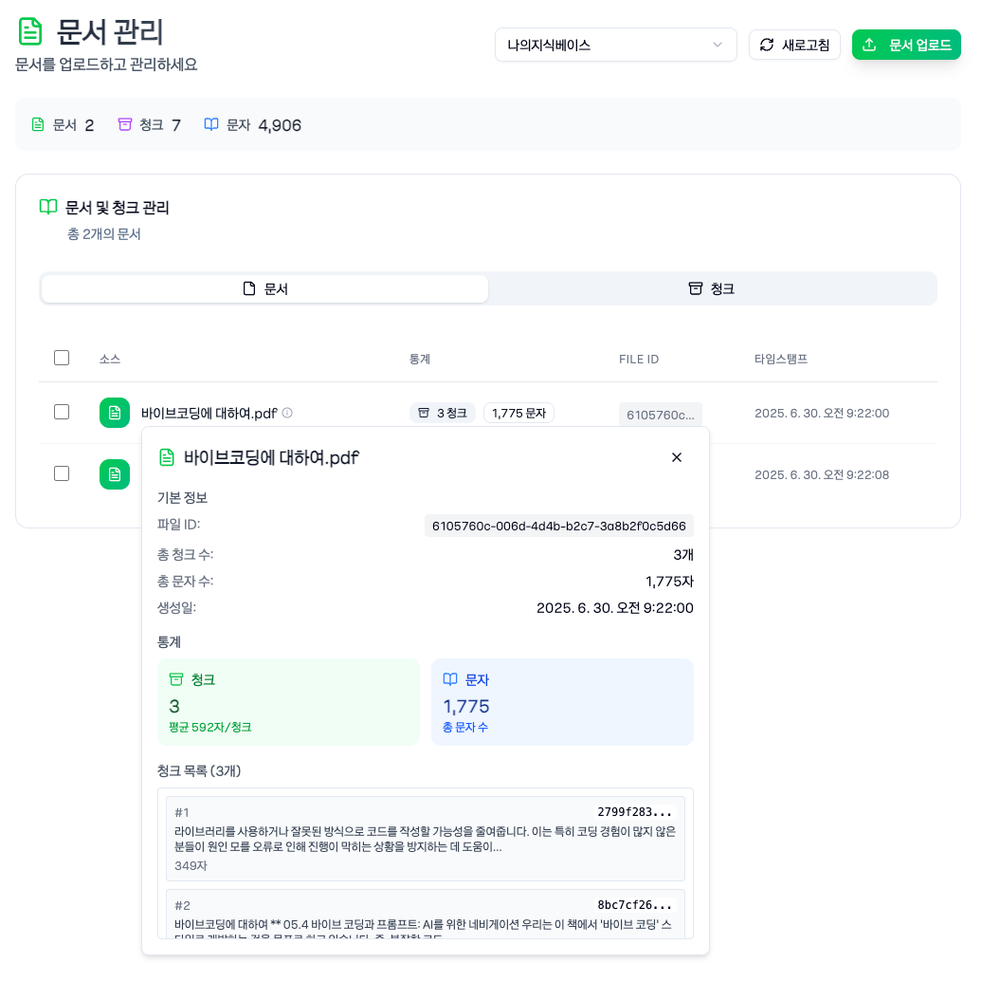
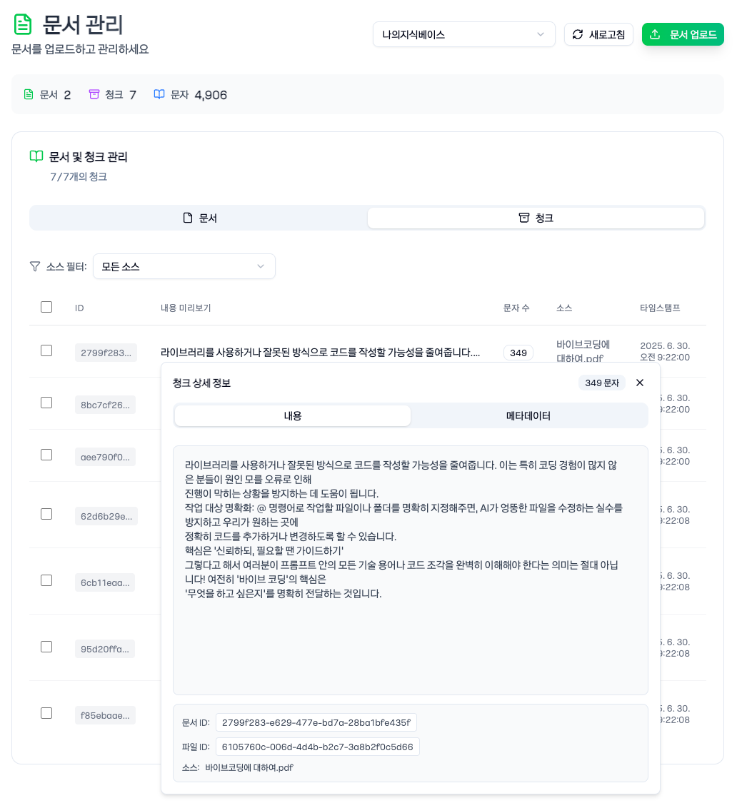
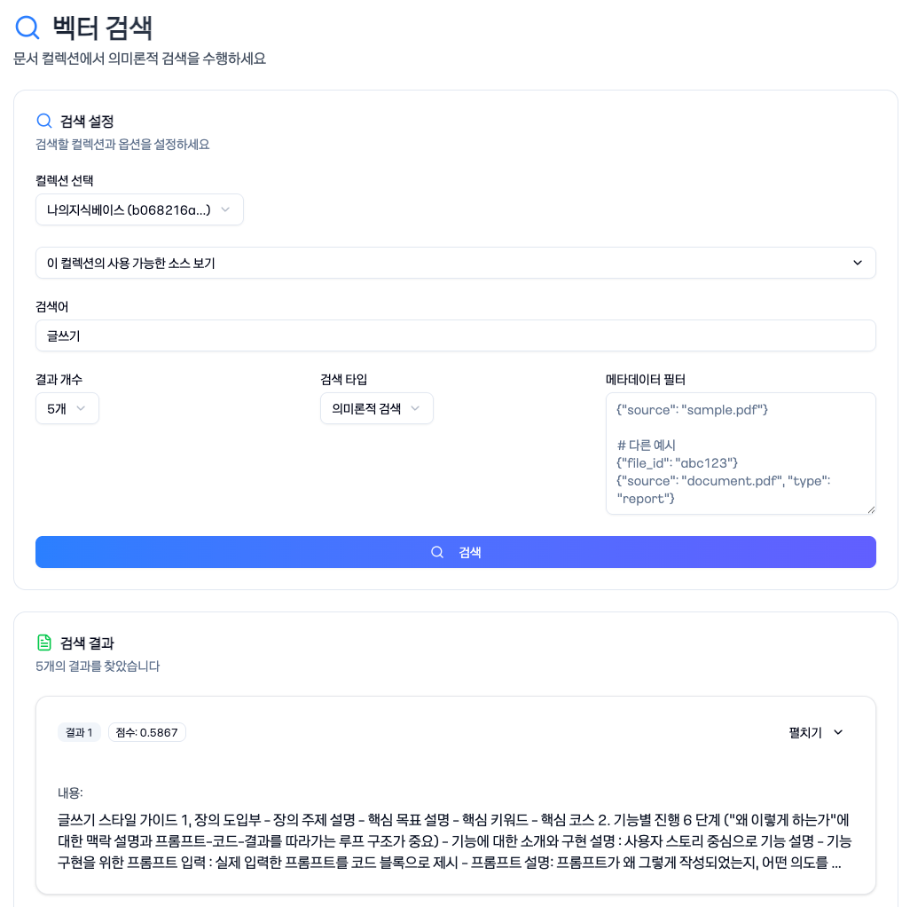
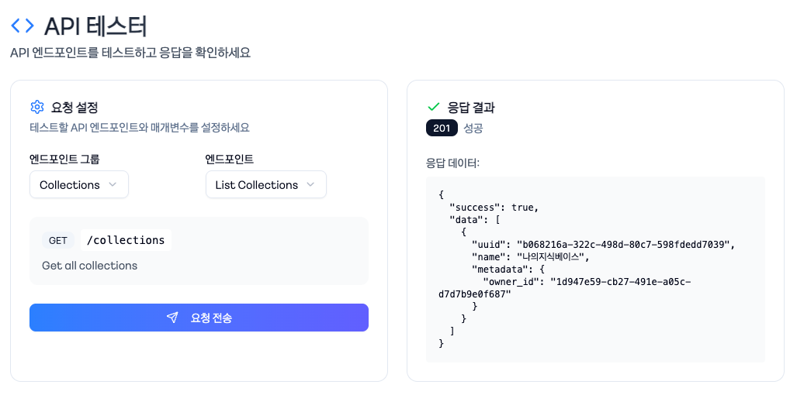

# LangConnect Next.js UI V2

LangConnect의 Next.js 기반 웹 인터페이스입니다. 벡터 데이터베이스를 활용한 문서 관리 및 검색 시스템을 제공합니다.

## 🚀 소개

LangConnect Next.js UI는 기존 Streamlit 인터페이스를 현대적인 Next.js 14 애플리케이션으로 마이그레이션한 프로젝트입니다. 사용자 친화적인 인터페이스를 통해 문서 관리, 벡터 검색, API 테스트 등의 기능을 제공합니다.

### 주요 기능

- 📁 **컬렉션 관리**: 문서를 체계적으로 그룹화하고 관리
- 📄 **문서 관리**: 문서 업로드, 조회, 삭제 및 청크 단위 관리
- 🔍 **벡터 검색**: 의미론적, 키워드, 하이브리드 검색 지원
- 🧪 **API 테스터**: REST API 엔드포인트 테스트 도구
- 🔐 **인증 시스템**: NextAuth.js 기반 안전한 사용자 인증

## 📸 화면 미리보기

### 메인 페이지


### 컬렉션 관리


### 문서 목록


### 문서 청크


### 벡터 검색


### API 테스터


## 🛠️ 기술 스택

- **프레임워크**: Next.js 15 (App Router)
- **UI 라이브러리**: shadcn/ui, Tailwind CSS 4
- **상태 관리**: React Hooks
- **인증**: NextAuth.js
- **아이콘**: Lucide React
- **타입스크립트**: 타입 안정성 보장

## 📦 설치 방법

### 사전 요구사항

- Node.js 18.0 이상
- npm 또는 pnpm
- LangConnect API 서버 실행 중

### 1. 저장소 클론

```bash
git clone https://github.com/jikime/next-connect-ui
cd next-connect-ui
```

### 2. 의존성 설치

```bash
# npm 사용
npm install

# 또는 pnpm 사용
pnpm install
```

### 3. 환경 변수 설정

`.env` 파일을 생성하고 다음 환경 변수를 설정합니다:

```env
# NextAuth 설정
NEXTAUTH_URL=http://localhost:3893
NEXTAUTH_SECRET=lang-connect-server-secret

# API 서버 URL
NEXT_PUBLIC_API_URL=http://localhost:8080
```

### 4. 개발 서버 실행

```bash
# npm 사용
npm run dev

# 또는 pnpm 사용
pnpm dev
```


브라우저에서 `http://localhost:3893`으로 접속합니다.

## 🐳 Docker 사용법
### nextjs build
``bash
npm run build
```

### Docker 이미지 빌드

```bash
docker build -t next-langconnect-ui .
```

### Docker 컨테이너 실행

```bash
docker run -p 3893:3893 next-langconnect-ui
```

### Docker Compose 사용

`docker-compose.yml` 파일 예시:

```yaml
version: '3.8'

services:
  nextjs:
    build:
      context: ./next-connect-ui
      dockerfile: Dockerfile
    container_name: next-connect-ui
    restart: always
    depends_on:
      - api
    ports:
      - "3893:3893"
    environment:
      API_URL: http://api:8080
    networks:
      - langconnect-network
networks:
  langconnect-network:
    driver: bridge
```

실행:
```bash
docker-compose up -d
```

## 📖 사용법

### 1. 로그인
- 메인 페이지에서 이메일과 비밀번호로 로그인
- 계정이 없다면 회원가입 진행

### 2. 컬렉션 생성
1. 좌측 사이드바에서 "컬렉션" 메뉴 클릭
2. "새 컬렉션" 버튼 클릭
3. 컬렉션 이름과 메타데이터 입력
4. "생성" 버튼 클릭

### 3. 문서 업로드
1. "문서" 메뉴로 이동
2. "문서 업로드" 탭 선택
3. 컬렉션 선택 후 파일 업로드
4. 청크 크기와 오버랩 설정
5. "업로드 및 임베드" 버튼 클릭

### 4. 벡터 검색
1. "검색" 메뉴로 이동
2. 컬렉션 선택
3. 검색어 입력 및 검색 타입 선택
4. 필요시 메타데이터 필터 추가
5. "검색" 버튼 클릭

### 5. API 테스트
1. "API 테스터" 메뉴로 이동
2. 엔드포인트 그룹과 메서드 선택
3. 필요한 파라미터 입력
4. "요청 전송" 버튼 클릭
5. 응답 결과 확인

## 🔧 주요 설정

### 청크 설정
- **청크 크기**: 100-5000자 (기본값: 1000)
- **청크 오버랩**: 0-1000자 (기본값: 200)

### 검색 설정
- **Semantic**: 벡터 유사도 기반 검색
- **Keyword**: 키워드 매칭 검색
- **Hybrid**: 두 방식을 결합한 검색

### API 엔드포인트
- Health Check: `/health`
- Collections: `/collections`
- Documents: `/collections/{id}/documents`
- Search: `/collections/{id}/documents/search`

## 📄 라이선스

이 프로젝트는 MIT 라이선스를 따릅니다.

## 📞 문의

프로젝트 관련 문의사항은 이슈 트래커를 통해 남겨주세요.